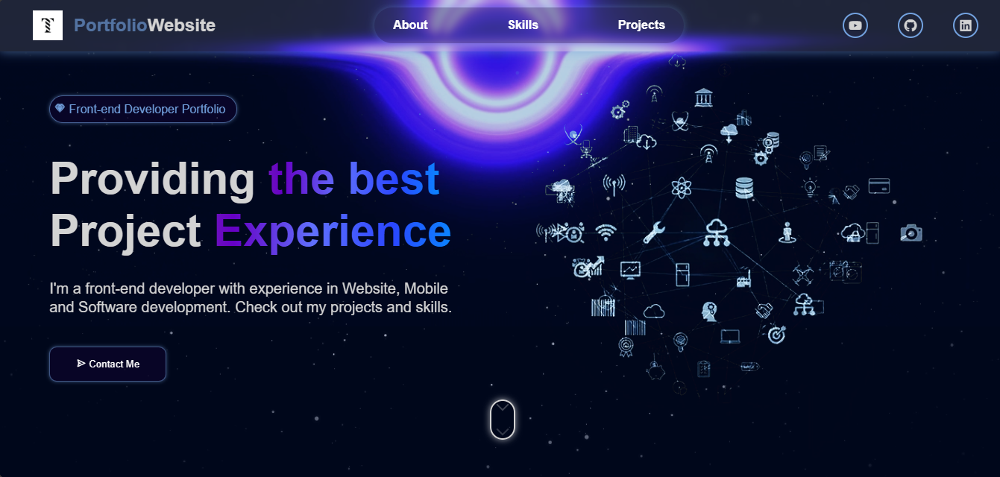
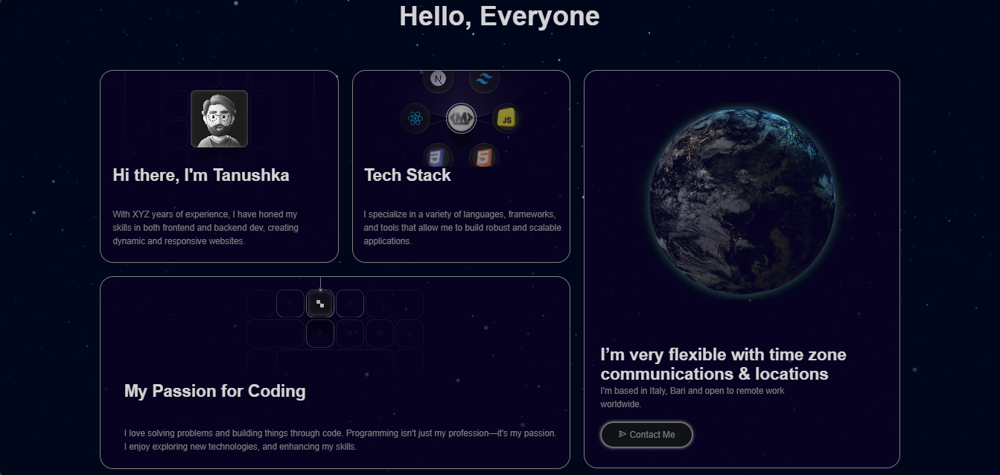
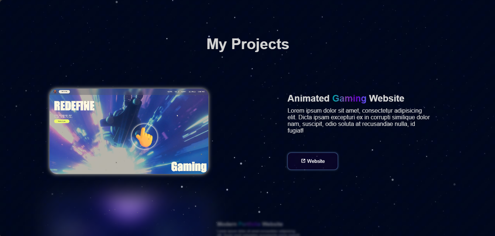
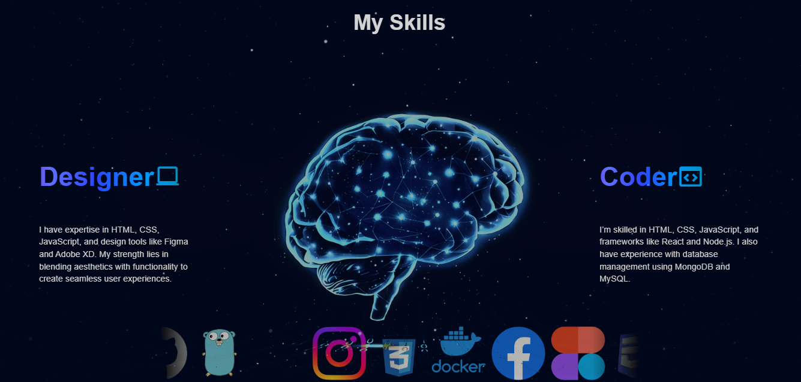
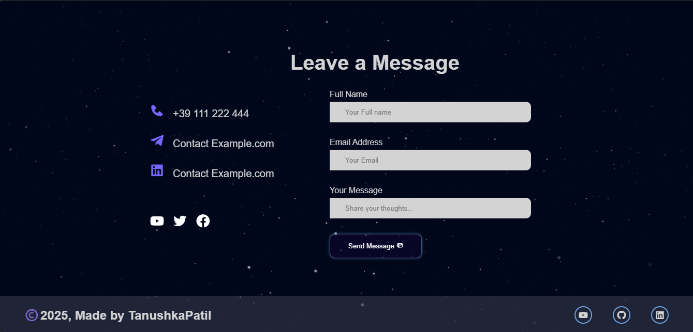

# 🌌 Animated Personal Portfolio

A responsive, visually immersive animated portfolio website built using **HTML, CSS, and JavaScript**, featuring smooth scroll-triggered animations, a sidebar menu, and interactive video showcases.

---

## 🚀 Features

- ✨ **Hero Section** with background video and animated text  
- 🌀 **Scroll Animations** (`autoBlur`, `autoDisplay`, `fadein-left`) for smooth section reveals  
- 🎥 **Interactive Project Cards** that play videos on hover  
- 📱 **Responsive Design** with media queries for various screen sizes (desktop, tablet, mobile)  
- 📂 **Sidebar Menu** with open/close animation using keyframes  
- 💡 **Hover Effects** and a subtle blurred footer for a futuristic aesthetic  
- 🌐 **Social Media Links** and contact section  
- 🧠 Organized and clean structure with modular CSS and JS logic

---
## 🖼️ OUTPUT Preview

  
  
  
  
  

---
## 🛠 Tech Stack

- **Frontend:** HTML5, CSS3, JavaScript (Vanilla)
- **Animations:** CSS Keyframes + JS Scroll/Event Triggers
- **Responsive Design:** Mobile-first approach using media queries

---

## ⚙️ How It Works

- On page load, sections animate into view using `animation-timeline: view()`.
- Hovering over a project video triggers autoplay and shows a hover sign.
- The hamburger menu triggers a sidebar animation with smooth transitions.
- Media queries ensure a clean experience across all screen sizes.

---

## 📱 Responsive Breakpoints

| Screen Width      | Adjustments Made                              |
|-------------------|-----------------------------------------------|
| `≤ 1200px`        | Smaller headers, scaled sections              |
| `≤ 700px`         | Sidebar replaces top nav, column stacking     |
| `≤ 480px`         | Hidden video boxes, minimized typography      |

---

## 📌 How to Use

1. Clone the repository or download the source code.
2. Place your video files inside `assets/videos/` and update paths in `index.html`.
3. Open `index.html` in your preferred browser.
4. Customize content, colors, fonts as needed in `style.css`.

---

## 🧩 Customization Tips

- 🎨 Change background or highlight colors in the CSS.
- 📽️ Replace project videos with your own demos.
- ✍️ Update contact links and project descriptions.

---

## ✅ Best Practices Followed

- Semantic HTML
- Modular CSS for layout, animation, and responsiveness
- Clean JS with event listeners and no global scope pollution
- Mobile-first design with scalable layout
- Scroll animation based on view triggers

---

## 💡 Future Enhancements

- Dark/Light mode toggle
- Accessibility improvements (keyboard nav, ARIA tags)
- IntersectionObserver instead of animation-timeline (for better support)
- React version with modular components
- Deployment to GitHub Pages or Vercel

---

## 👩‍💻 Developed By

**Tanushka Patil**  
[Portfolio](#) • [GitHub](#) • [LinkedIn](#)

---

